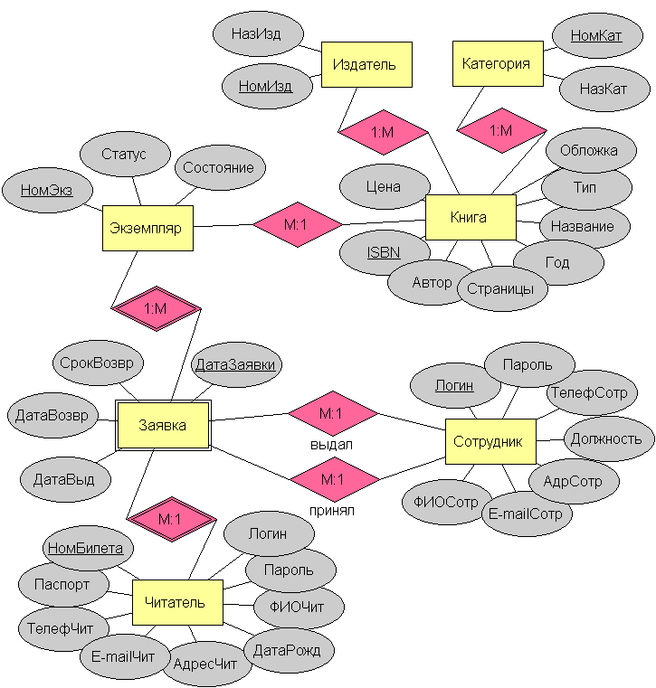
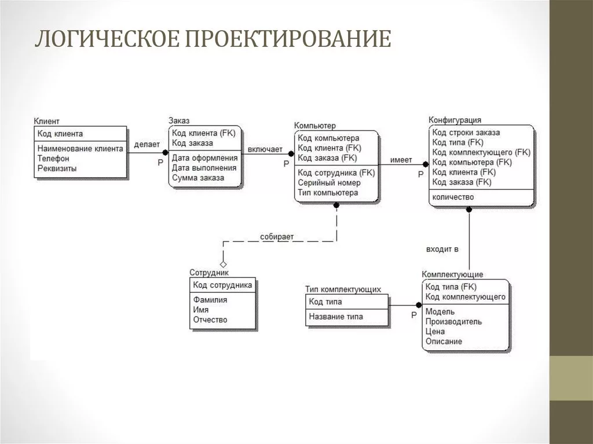
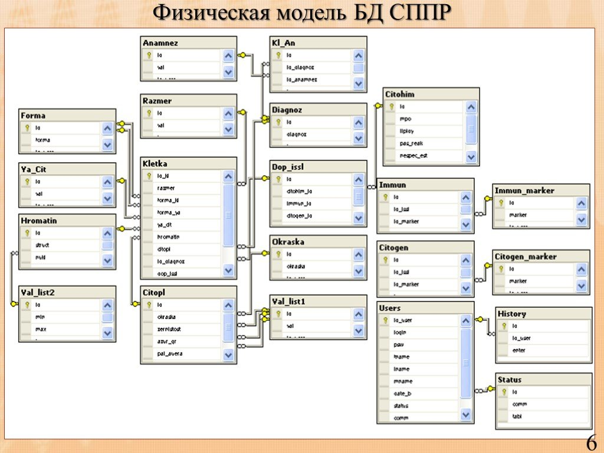

# БД

## Проектирование

Проектирование можно разбить на (не всегда этому следуют):
1. Определение сущности;
2. Определение взаимосвязей между сущностями;
3. Задание первичных и альтернативных ключей, определение атрибутов;
4. Приведение модели к требуемому уровню нормальной формы;
5. Физическое описание модели.

Задачи проектирования ДБ:
1. "Как адекватно отразить предметную область и информационные потребности пользователей в семантическую БД"
2. "Каким образом отразить объекты предметной области в абстрактные объекты модели данных, чтобы это отображение не противоречило семантике предметной области"
3. "Как обеспечить эффективность выполнения запросов к БД"

Общая методология проектирования состоит из трёх фаз:
1. концептуальной - конструирование информационной модели. Самый высокий уровень абстракции. "Первичный запрос. Какие сущности, какие связи. Можно рисовать хоть в пеинте" 
2. логическая - конструирование (создание схемы БД) без оглядки на конкретную СУБД и физических условий реализаций. Так же желательно нормализовать БД.  
3. физическая - конкретная реализация 

## Нормализация

Наиболее важные требования при нормализации:
- Первичные ключи отношений должны быть минимальными;
- Число отношений БД должно по возможности давать наименьшую избыточность данных;
- Число отношений БД не должно приводить к потере производительности системы;
- Данные не должны быть противоречивыми (т.е. при удалении, включении, обновлении данных, их потенциальная противоречивость должна быть сведена к минимуму);
- Схема отношений БД должна быть устойчивой, способной адаптироваться к изменениями при её расширении дополнительными атрибутами.

Теория функциональных зависимостей позволяет установить определённые требования к схемам отношений в реляционной БД. Эти требования формулируются в терминах свойств отношений, и называются *нормальными формами схем отношений*. Каждая нормальная форма отношений связана с определённым классом ФЗ, которые представлены в отношениях.  
*Процесс устранения потенциальной противоречивости и избыточности данных в отношениях реляционной БД называется нормализацией исходных схем отношений.*   
*На минимальном покрытии, как правило, не может быть достигнута высокая производительность обработки запросов.*

НФ:
1. 1НФ - все атрибуты отношения являются простыми (требование атомарности атрибутов в реляционной модели).
2. 2НФ - находится в 1НФ, и не неключевые атрибуты отношения функционально полно зависят от составного ключа отношения.
3. 3НФ - находится в 2НФ, и все неключевые атрибуты отношения зависят только от первичного ключа.
4. Бойса-Кодда - находится в 3НФ, и отсутствуют зависимости ключевых атрибутов от неключевых атрибутов. (в отличии от 3НФ, исходные отношения не всегда могут быт приведены в НФБК)
5. 4НФ - находится в 3НФ или НФБК, и все независимые многозначные ФЗ разнесены в отдельные отношения с одним и тем же ключом. (не сильно применимо на практике)
6. 5НФ - находится в 4НФ, и удволетворяет зависимости по соединению относительно своих проекций. (не сильно применимо на практике)

## SQL

SQL можно поделить на:
- DDL - объектов БД. `CREATE ALTER DROP`
- DML - данных БД. `SELECT INSERT DELETE`
