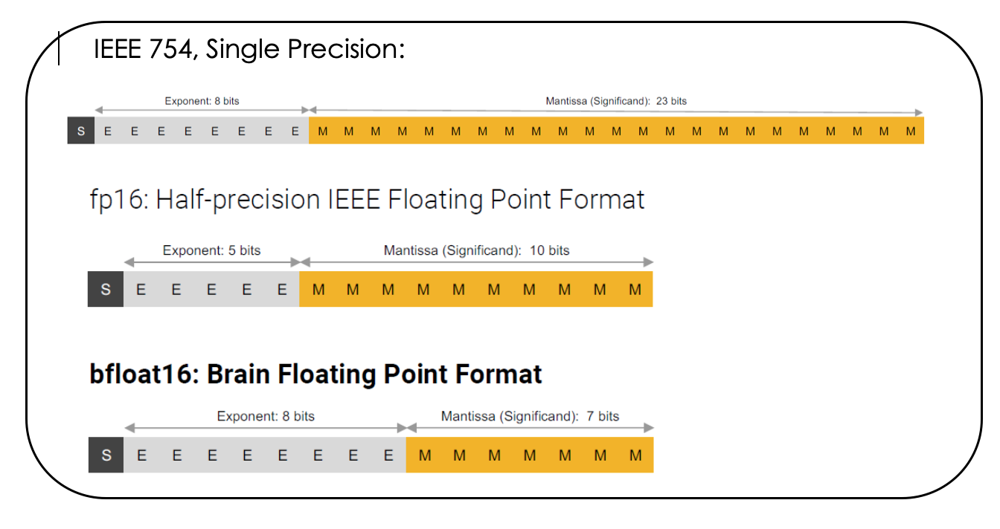

# 1 лекция

[31 источник, по которому стоит писать КР и прочее счастье](https://libeldoc.bsuir.by/handle/123456789/38125)

Команда - инструкция машине на исполнение элементарной операции.
Операнд - данные, с которыми будет выполнятся операция.

Суть принципа программного управления:

- Все вычисления предписанные алгоритмом решения задачи, должны быть представлены в виде программы, состоящей из последовательности управляющих слов
- Каждая программа содержит указания на конкретную выполняемую операцию, место нахождения (адрес) операндов и ряд служебных признаков
- Для доступа к программам, командам и операндам используются из адреса, в качестве которых выступают номера ячеек памяти компьютера, предназначенных для хранения объектов
- Команды программы распложены в памяти друг за другом, что позволяет микропроцессору организовывать выборку цепочки команд из последовательно расположенных ячеек памяти и выполнять их по цепочке
- Для перехода к выполнению не следующей по порядку команды, а к какой-то другой, используися команды условного или безусловного переходов. Выборка команд из памяти прекращается после достижения и выполнения команды "стоп". Таким образом, процессор исполняет программу автоматически, без вмешательства человека

Вышеописанные принципе были описаны в 45-м году, однако даже с появлением ЭВМ это полностью реализовать не удалось.

## представление чисел в памяти компьютера

Обработка чисел происходит в формате, с плавающей точкой (в учебниках - с плавающей запятой).
Обработка чисел на данный момент не происходит с фиксированной точкой, так как это неэффективно. Однако, раньше такое происходило, так что есть процессорами с двумя АЛУ. (для обработки с плавающей и фиксированной)

```
Прямой код - количественная оценка числа. Например: 0.111(2) = +7(10); 1.111(2) = -7(2)
Обратный код - 0.111; 1.000 - инверсия
Дополнительный код - 0.111; 1.001 - инверсия +1 к младшему разряду. Переводить так в обе стороны (из 0001 = 1111)
```

**Переполнение чисел** - предыдущий метод не крут для матеши в контексте пк. По этому, используются модифицированные обратные коды (МОК).  
В МОК вместо вычитания, используется сложение и инверсия числа (А - B = A + (-B))

Знаковые поля:

```
  00 - положительное число
  11 - отрицательное число
  01, 10, 111 и так далее - переполнение. Лезь в учебник, я хз как с этим справляться
```

**_Первые 4 практические - по ним будет контрольная_**

# практика. Вещественные числа

Отличие числа с фиксированной и плавающей точкой по факту только в том, что ты можешь точку свободно перемещать.
А = (-1)^S + M + B^E

Числа с плавающей точку, располагается в памяти согласно **_IEEE 754-2008_**.

## IEEE 754-2008

Согласно стандарту, существует точности (в названиях не уверен):
- половинная - 2 байта, М = 10 бита, E = 5 бит
- одинарная - 4 байта, М = 23 бита, E = 8 бит
- двойная - 8 байта, М = 52 бита, E = 11 бит
- четверная - 16 байта, М = 112 бита, E = 15 бит

